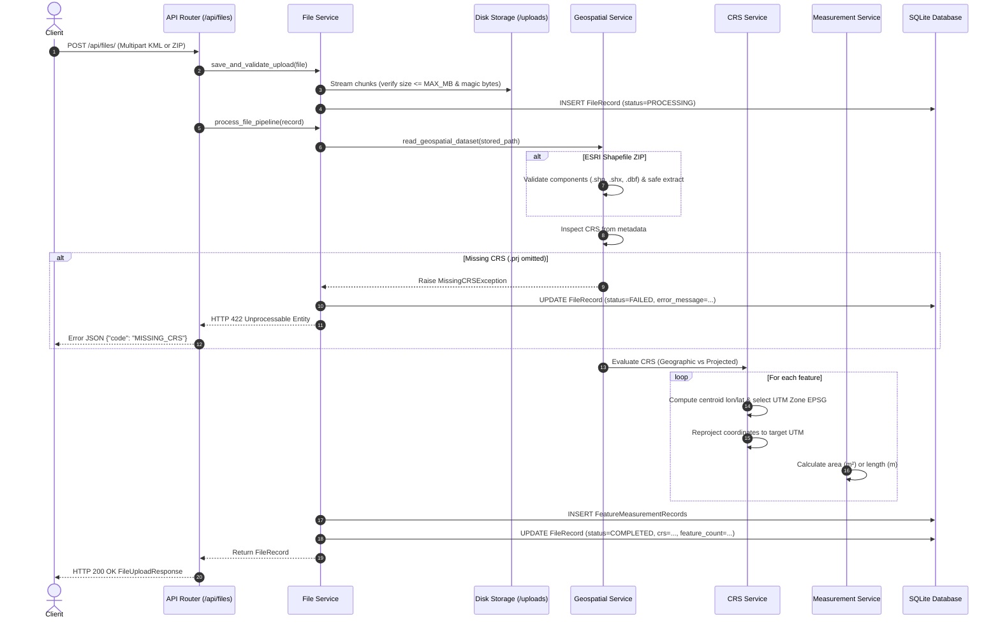

# Geospatial File Measurement API

A production-grade backend REST API built with **FastAPI**, **GeoPandas**, **Shapely**, and **PyProj** that accepts geospatial vector files (KML and ESRI Shapefile ZIP archives), safely inspects and processes geographic features, strictly handles Coordinate Reference Systems (CRS) using local UTM projections, calculates accurate metric measurements (area in $m^2$, length in $m$), and returns structured JSON responses.

---

## Table of Contents

1. [Project Overview](#project-overview)
2. [Key Features](#key-features)
3. [Technology Stack](#technology-stack)
4. [Architecture & Data Processing Flow](#architecture--data-processing-flow)
5. [Directory Structure](#directory-structure)
6. [Why Geographic Coordinates Cannot Directly Be Measured](#why-geographic-coordinates-cannot-directly-be-measured)
7. [CRS Reprojection & Measurement Strategy](#crs-reprojection--measurement-strategy)
8. [API Endpoints & Documentation](#api-endpoints--documentation)
9. [Example Requests & Responses](#example-requests--responses)
10. [Local Development & Setup](#local-development--setup)
11. [Docker & Containerized Deployment](#docker--containerized-deployment)
12. [Environment Configuration](#environment-configuration)
13. [Security Architecture](#security-architecture)
14. [Error Handling Strategy](#error-handling-strategy)
15. [Automated Testing & Verification](#automated-testing--verification)
16. [Design Decisions & Rationale](#design-decisions--rationale)
17. [Production Considerations & Future Architecture](#production-considerations--future-architecture)
18. [Trade-offs & Limitations](#trade-offs--limitations)
19. [Suggested Git Commit History](#suggested-git-commit-history)

---

## Project Overview

Geospatial data formats such as Google Earth KML (`.kml`) and ESRI Shapefiles (`.shp` within `.zip`) are industry-standard representations of geographic vector features. However, raw geospatial files often store coordinates in spherical angular units (degrees of longitude and latitude under **EPSG:4326 / WGS84**). 

Directly applying Euclidean geometry calculations (such as `polygon.area` or `linestring.length`) to angular coordinates yields mathematically invalid results in $\text{degrees}^2$ or $\text{degrees}$, rather than standard metric units ($m^2$ or $m$). Furthermore, spherical convergence causes a degree of longitude to shrink from ~111.3 km at the equator down to 0 km at the poles.

This service solves that problem by:
1. Validating and securely ingesting geospatial uploads.
2. Dynamically determining the geometry's geographic location.
3. Reprojecting features into optimal local conformal cartographic projections (**Universal Transverse Mercator - UTM**).
4. Accurately computing true ground metric measurements in $m^2$ and $m$.
5. Persisting feature-level attributes and metrics in a relational database with complete lifecycle status tracking.

---

## Key Features

- **Format Support**:
  - Google Earth KML (`.kml`) with multi-layer parsing via Pyogrio.
  - ESRI Shapefile archives (`.zip`) containing `.shp`, `.shx`, `.dbf`, and optional `.prj` / `.cpg`.
- **Geodetic & Cartographic Accuracy**:
  - Automatic centroid extraction and UTM zone calculation ($1 \le \text{zone} \le 60$) with Northern/Southern hemisphere EPSG code selection ($32601-32660$ / $32701-32760$).
  - High-latitude Universal Polar Stereographic (UPS North `EPSG:32661` / UPS South `EPSG:32761`) fallbacks.
  - Preservation of valid pre-projected metric coordinate reference systems (e.g. State Plane, National Grids, existing UTM).
- **Supported Geometries & Metrics**:
  - `Polygon` $\rightarrow$ Area ($m^2$).
  - `MultiPolygon` $\rightarrow$ Total aggregate area ($m^2$).
  - `LineString` $\rightarrow$ Length ($m$).
  - `MultiLineString` $\rightarrow$ Total aggregate length ($m$).
  - `Point` / `MultiPoint` $\rightarrow$ Processed safely without calculation (`measurement: null`, `status: COMPLETED`).
  - Complex / Unsupported types (e.g. `GeometryCollection`) $\rightarrow$ Safely handled without crashing (`measurement: null`, `status: UNSUPPORTED`).
- **Production Defense-in-Depth**:
  - Memory-safe chunked streaming upload with configurable byte ceilings (`MAX_UPLOAD_SIZE_MB`).
  - Magic byte MIME header verification to thwart extension spoofing.
  - Zip-Slip path traversal defense rejecting any entry containing relative path traversal (`..`), absolute roots, or drive letters.
  - UUIDv4 on-disk filename isolation preventing path injection and directory disclosure.
  - Sanitized error envelopes preventing stack trace leakage to clients.
- **Developer Experience**:
  - Interactive OpenAPI/Swagger documentation (`/docs`) and ReDoc (`/redoc`).
  - Health check probe (`/health`).
  - 100% test pass rate with Pytest (33 unit, integration, and security test cases).

---

## Technology Stack

| Layer | Technology | Purpose & Rationale |
| :--- | :--- | :--- |
| **Framework** | FastAPI 0.115+ | High-throughput async framework with native OpenAPI schema generation and Pydantic validation. |
| **ASGI Server** | Uvicorn 0.30+ | High-performance, production-ready ASGI server for Python. |
| **Geospatial Processing** | GeoPandas 1.0+, Pyogrio 0.9+, Fiona 1.9+ | Vector data ingestion, OGR driver abstraction, multi-layer KML reading, and spatial data frames. |
| **Spatial Engine** | Shapely 2.0+ | Fast GEOS-backed computational geometry algorithms for planar metrics and coordinate transformations. |
| **CRS & Geodesy** | PyProj 3.7+ | PROJ C-API bindings for geodetic forward/inverse projection and ellipsoidal parameter math. |
| **Database & ORM** | SQLite + SQLAlchemy 2.0+ | Relational schema modeling with connection pooling, foreign key integrity, and JSON column support. |
| **Data Validation** | Pydantic 2.8+ & Pydantic-Settings | Strongly-typed request/response models and environment variable parsing. |
| **Testing** | Pytest 8.0+, pytest-asyncio, HTTPX | Automated test suite with isolated SQLite in-memory fixtures and synthetic vector datasets. |
| **Containerization** | Docker & Docker Compose | Multi-stage build with non-root user execution and health checking. |

---

## Architecture & Data Processing Flow

The application follows clean architectural separation:

```
FastAPI Router (app/api)
       │
       ▼
File Lifecycle Service (app/services/file_service.py)
       │
       ├──► File Security & Utilities (app/utils/file_utils.py)
       ├──► Geospatial Ingestion (app/services/geospatial_service.py)
       │           │
       │           ├──► CRS Service (app/services/crs_service.py)
       │           └──► Measurement Service (app/services/measurement_service.py)
       │
       └──► Persistence Layer (app/db/models.py, SQLite)
```

### Detailed Pipeline Flow



---

## Directory Structure

```
geospatial_api/
├── .env.example              # Template environment configuration
├── .gitignore                # Production git exclusion patterns
├── Dockerfile                # Multi-stage container definition
├── docker-compose.yml        # Docker compose orchestration
├── pyproject.toml            # Project packaging specification
├── requirements.txt          # Python dependency requirements
├── README.md                 # Complete documentation
│
├── app/
│   ├── __init__.py
│   ├── main.py               # Application factory & OpenAPI definition
│   ├── api/
│   │   ├── __init__.py
│   │   ├── router.py         # Main router composition
│   │   └── routes/
│   │       ├── __init__.py
│   │       ├── files.py      # /api/files/ endpoints
│   │       └── health.py     # /health endpoint
│   ├── core/
│   │   ├── __init__.py
│   │   ├── config.py         # Pydantic Settings
│   │   └── logging.py        # Structured logging setup
│   ├── db/
│   │   ├── __init__.py
│   │   ├── database.py       # Engine, session, pragma setup
│   │   └── models.py         # FileRecord & FeatureMeasurementRecord
│   ├── exceptions/
│   │   ├── __init__.py
│   │   ├── custom_exceptions.py  # Domain exception hierarchy
│   │   └── handlers.py       # Global exception translators
│   ├── schemas/
│   │   ├── __init__.py
│   │   ├── common.py         # Enums, ErrorResponse, HealthResponse
│   │   ├── file.py           # FileUploadResponse, FileInfoResponse
│   │   └── measurement.py    # MeasurementItem, FeatureMeasurementResponse
│   ├── services/
│   │   ├── __init__.py
│   │   ├── crs_service.py    # UTM selection & geometry reprojection
│   │   ├── file_service.py   # Upload streaming, validation & pipeline
│   │   ├── geospatial_service.py # Vector dataset ingestion & extraction
│   │   └── measurement_service.py# Planar metric computation
│   └── utils/
│       ├── __init__.py
│       └── file_utils.py     # Magic bytes, Zip-Slip, safe extraction
│
├── tests/
│   ├── __init__.py
│   ├── conftest.py           # In-memory SQLite & isolated upload fixtures
│   ├── fixtures/
│   │   ├── __init__.py
│   │   └── sample_generators.py # Programmatic KML & Shapefile generators
│   ├── test_health.py        # Health probe tests
│   ├── test_file_validation.py # Extensions, empty files, size limits
│   ├── test_security.py      # Zip Slip traversal & info leakage tests
│   ├── test_crs_service.py   # UTM calculations & reprojection tests
│   ├── test_measurement_service.py # Polygon/Line/Point geometry calculations
│   ├── test_geospatial_accuracy.py # EPSG:4326 vs Metric area verification
│   └── test_api_files.py     # Full end-to-end API integration tests
│
└── uploads/
    └── .gitkeep              # On-disk upload directory placeholder
```

---

## Why Geographic Coordinates Cannot Directly Be Measured

### The Problem with EPSG:4326 (WGS84)

Geographic coordinate systems (such as WGS84, `EPSG:4326`) express positions as angles on a three-dimensional reference ellipsoid:
- **Longitude ($\lambda$)**: East-West angle from the Prime Meridian ($-180^\circ \text{ to } +180^\circ$).
- **Latitude ($\phi$)**: North-South angle from the Equator ($-90^\circ \text{ to } +90^\circ$).

If you compute area or length directly on geometry stored in `EPSG:4326` using Cartesian formulas:
$$\text{Area} = \frac{1}{2} \sum_{i=0}^{n-1} (x_i y_{i+1} - x_{i+1} y_i)$$

The resulting quantity has the units of **square degrees ($\text{deg}^2$)**, not square meters.

#### Meridian Convergence
While $1^\circ$ of latitude is approximately constant at $\approx 111.13\text{ km}$ across the globe, the ground distance of $1^\circ$ of longitude varies as a cosine function of latitude:
$$\Delta x \approx 111.320 \times \cos(\phi) \text{ km}$$

- At the **Equator** ($\phi = 0^\circ$): $1^\circ \text{ lon} \approx 111.32\text{ km}$.
- At **London / Paris** ($\phi \approx 50^\circ$): $1^\circ \text{ lon} \approx 71.55\text{ km}$.
- At the **Arctic Circle** ($\phi \approx 66.5^\circ$): $1^\circ \text{ lon} \approx 44.40\text{ km}$.
- At the **Poles** ($\phi = 90^\circ$): $1^\circ \text{ lon} = 0\text{ km}$.

A naive calculation on a $1^\circ \times 1^\circ$ box at the equator yields:
$$\text{Naive Area} = 1.0 \times 1.0 = 1.0 \text{ deg}^2$$
Whereas the true surface area is:
$$111,320\text{ m} \times 111,130\text{ m} \approx 12,370,000,000\text{ m}^2 \quad (\approx 12,370\text{ km}^2)$$

At $60^\circ$ North, a $1^\circ \times 1^\circ$ box also has a naive area of $1.0\text{ deg}^2$, but its actual surface area is roughly half of that ($\approx 6,185\text{ km}^2$). Direct calculations in geographic coordinates are fundamentally incorrect and meaningless for metric measurement.

---

## CRS Reprojection & Measurement Strategy

To produce exact, ground-truth measurements in meters ($m$) and square meters ($m^2$), the service implements the following strategy:

```
Feature Source CRS
       │
       ├── Is CRS Missing? ──► Raise MissingCRSException (Reject with 422)
       │
       ├── Is CRS already a valid local projected metric CRS? (e.g. State Plane, UTM, BNG)
       │       └──► Use directly (No reprojection needed)
       │
       └── Is CRS Geographic (EPSG:4326, NAD83) or Web Mercator (EPSG:3857)?
               │
               ▼
       Compute Feature Centroid: (lon, lat)
               │
               ▼
       Calculate UTM Zone:
       zone = int((lon + 180) / 6) + 1  [1 <= zone <= 60]
               │
               ▼
       Determine Hemisphere:
       lat >= 0 ? EPSG: 32600 + zone (North)
       lat < 0  ? EPSG: 32700 + zone (South)
               │
               ▼
       Reproject Feature via pyproj.Transformer (always_xy=True)
               │
               ▼
       Compute Planar Metric Measurements:
       Polygon: shapely.area -> m²
       LineString: shapely.length -> m
       Point: No calculation -> null
```

### Why UTM?
The **Universal Transverse Mercator (UTM)** system divides the Earth into 60 six-degree longitudinal zones. Within each zone, the projection is conformal (preserves local angles and shapes), with a central scale factor of $0.9996$. Scale distortion is strictly bounded within **$0.1\%$ (1 part in 1,000)** across the entire zone. Selecting the local UTM zone based on each feature's centroid guarantees maximal measurement precision.

### Web Mercator (EPSG:3857) Notice
Web Mercator is projected, but its area distortion grows dramatically away from the equator by a factor of $\frac{1}{\cos^2(\phi)}$. At $60^\circ$ latitude, Web Mercator area is inflated by **$400\%$**! The service explicitly identifies EPSG:3857, extracts ground longitude/latitude, and reprojects into local UTM to ensure true metric results.

---

## API Endpoints & Documentation

| Method | Endpoint | Description | Status Codes |
| :--- | :--- | :--- | :--- |
| **GET** | `/health` | Liveness and readiness health probe | `200` |
| **POST** | `/api/files/` | Upload and process KML or Shapefile ZIP | `200`, `400`, `413`, `422`, `500` |
| **GET** | `/api/files/{id}/` | Retrieve file status and processing metadata | `200`, `404` |
| **GET** | `/api/files/{id}/measurements/` | Retrieve calculated measurements for all features | `200`, `404` |

> [!NOTE]
> All endpoints support both trailing slashes (e.g. `/api/files/`) and non-trailing slashes (e.g. `/api/files`) without redirects.

---

## Example Requests & Responses

### 1. Health Check

```bash
curl -X GET http://localhost:8000/health
```

**Response (HTTP 200)**:
```json
{
  "status": "ok"
}
```

---

### 2. Upload KML File

```bash
curl -X POST http://localhost:8000/api/files/ \
  -F "file=@survey.kml"
```

**Response (HTTP 200)**:
```json
{
  "id": "60f30bdc-ae0d-410f-bbeb-d35e5b470a1b",
  "filename": "survey.kml",
  "feature_count": 3,
  "crs": "EPSG:4326",
  "status": "COMPLETED"
}
```

---

### 3. Upload Shapefile ZIP Archive

```bash
curl -X POST http://localhost:8000/api/files/ \
  -F "file=@cadastre.zip"
```

**Response (HTTP 200)**:
```json
{
  "id": "7ddde836-f16a-4b01-a39c-0d8eefc91fa3",
  "filename": "cadastre.zip",
  "feature_count": 3,
  "crs": "EPSG:4326",
  "status": "COMPLETED"
}
```

---

### 4. Get File Metadata

```bash
curl -X GET http://localhost:8000/api/files/60f30bdc-ae0d-410f-bbeb-d35e5b470a1b/
```

**Response (HTTP 200)**:
```json
{
  "id": "60f30bdc-ae0d-410f-bbeb-d35e5b470a1b",
  "filename": "survey.kml",
  "feature_count": 3,
  "crs": "EPSG:4326",
  "status": "COMPLETED",
  "file_size_bytes": 1024,
  "error_message": null,
  "created_at": "2026-10-07T16:00:00Z",
  "updated_at": "2026-10-07T16:00:02Z"
}
```

---

### 5. Get Feature Measurements

```bash
curl -X GET http://localhost:8000/api/files/60f30bdc-ae0d-410f-bbeb-d35e5b470a1b/measurements/
```

**Response (HTTP 200)**:
```json
{
  "file_id": "60f30bdc-ae0d-410f-bbeb-d35e5b470a1b",
  "features": [
    {
      "feature_id": 0,
      "geometry_type": "Polygon",
      "crs": "EPSG:4326",
      "properties": {
        "name": "Building A"
      },
      "measurement": {
        "type": "area",
        "value": 1250.42,
        "unit": "m²"
      },
      "measurement_status": "COMPLETED"
    },
    {
      "feature_id": 1,
      "geometry_type": "LineString",
      "crs": "EPSG:4326",
      "properties": {
        "name": "Access Road 1"
      },
      "measurement": {
        "type": "length",
        "value": 452.73,
        "unit": "m"
      },
      "measurement_status": "COMPLETED"
    },
    {
      "feature_id": 2,
      "geometry_type": "Point",
      "crs": "EPSG:4326",
      "properties": {
        "name": "Survey Control Station"
      },
      "measurement": null,
      "measurement_status": "COMPLETED"
    }
  ]
}
```

---

### 6. Example Error Responses

#### Missing CRS (Shapefile lacking `.prj`) (HTTP 422)
```json
{
  "error": {
    "code": "MISSING_CRS",
    "message": "Missing Coordinate Reference System (CRS). ESRI Shapefile archives require a valid .prj file."
  }
}
```

#### Malformed or Incomplete Shapefile (HTTP 400)
```json
{
  "error": {
    "code": "INVALID_FILE",
    "message": "The uploaded ZIP Shapefile is missing required companion file(s): .dbf, .shx."
  }
}
```

#### Zip Slip Path Traversal Attempt (HTTP 400)
```json
{
  "error": {
    "code": "SECURITY_VIOLATION",
    "message": "Malicious entry detected in ZIP archive (path traversal '..'): ../../etc/passwd"
  }
}
```

---

## Local Development & Setup

### Prerequisites
- Python 3.11+
- Virtual environment manager (`uv` recommended, or standard `venv`)

### 1. Clone & Navigate
```bash
git clone https://github.com/your-username/geospatial-measurement-api.git
cd geospatial-measurement-api
```

### 2. Configure Virtual Environment & Install Dependencies
Using `uv`:
```bash
uv venv .venv --python 3.12
source .venv/bin/activate  # On Windows: .venv\Scripts\activate
uv pip install -r requirements.txt
```

Or using standard `pip`:
```bash
python -m venv .venv
source .venv/bin/activate  # On Windows: .venv\Scripts\activate
pip install --upgrade pip
pip install -r requirements.txt
```

### 3. Environment Configuration
Copy the sample environment file:
```bash
cp .env.example .env
```

### 4. Run the API Locally
```bash
uvicorn app.main:app --host 0.0.0.0 --port 8000 --reload
```
Navigate to:
- **Interactive Swagger UI**: [http://localhost:8000/docs](http://localhost:8000/docs)
- **ReDoc Documentation**: [http://localhost:8000/redoc](http://localhost:8000/redoc)
- **Health Check**: [http://localhost:8000/health](http://localhost:8000/health)

---

## Docker & Containerized Deployment

The application includes a production-ready, multi-stage Docker build that minimizes final image size and executes as an unprivileged non-root user (`appuser`, UID 10001).

### Build & Run with Docker Compose
```bash
docker compose up --build
```

The container automatically creates the required volume mounts for uploads (`api-uploads`) and database storage (`api-data`).

Verify container health:
```bash
docker compose ps
curl http://localhost:8000/health
```

---

## Environment Configuration

All settings are configured through environment variables or a `.env` file via `pydantic-settings`:

| Variable | Type | Default | Description |
| :--- | :--- | :--- | :--- |
| `APP_NAME` | `str` | `Geospatial Measurement API` | Application identifier displayed in OpenAPI. |
| `APP_VERSION` | `str` | `1.0.0` | Semantic version string. |
| `DATABASE_URL` | `str` | `sqlite:///./geospatial.db` | SQLAlchemy connection URI. |
| `UPLOAD_DIR` | `str` | `./uploads` | Directory for uploaded file storage. |
| `MAX_UPLOAD_SIZE_MB` | `int` | `50` | Maximum allowable upload file size in megabytes. |
| `MEASUREMENT_PRECISION` | `int` | `2` | Number of decimal places to round computed metrics. |
| `LOG_LEVEL` | `str` | `INFO` | Application logging verbosity (`DEBUG`, `INFO`, `WARNING`, `ERROR`). |

---

## Security Architecture

1. **Denial-of-Service (DoS) Protection via Chunk Streaming**:
   Uploads are received as streaming byte chunks ($64\text{ KB}$ buffers). If a stream exceeds `MAX_UPLOAD_SIZE_MB`, the stream is terminated and the temporary file is unlinked immediately, raising HTTP 413 without exhausting server memory.
2. **Zip Slip / Path Traversal Defense**:
   ZIP archives are scanned prior to extraction. Every archive member is tested against directory separators and `..` tokens. Furthermore, during extraction, `Path.resolve().relative_to(target_dir)` asserts that no file escapes the isolated extraction root.
3. **MIME & Magic Byte Verification**:
   Extensions alone are never trusted. ZIP files are checked against `PK\x03\x04` headers, and KML files are verified for valid XML root elements before parsing.
4. **UUIDv4 Storage Isolation**:
   Files are saved to disk with cryptographically random UUID names (e.g. `uploads/60f30bdc-...kml`). Client-provided filenames are only recorded as database metadata, eliminating arbitrary file overwrite and command injection risks.
5. **No Stack Trace Disclosure**:
   Internal exception handlers catch any unhandled server errors, log tracebacks server-side with context, and return sanitized JSON error envelopes with code `INTERNAL_SERVER_ERROR`.

---

## Error Handling Strategy

All errors conform to a predictable, strongly-typed JSON schema:

```json
{
  "error": {
    "code": "MACHINE_READABLE_CODE",
    "message": "Human readable description."
  }
}
```

Standardized HTTP status codes:
- `400 Bad Request`: Invalid file format, missing companion Shapefile files, empty file, or security violation (`INVALID_FILE`, `SECURITY_VIOLATION`).
- `404 Not Found`: Nonexistent file record or missing measurements (`FILE_NOT_FOUND`).
- `413 Payload Too Large`: Upload exceeding maximum size limit (`FILE_TOO_LARGE`).
- `422 Unprocessable Entity`: Corrupt geospatial file, unparseable geometry, or missing CRS (`CORRUPT_GEOSPATIAL_FILE`, `MISSING_CRS`).
- `500 Internal Server Error`: Unexpected internal processing exception (`INTERNAL_SERVER_ERROR`).

---

## Automated Testing & Verification

The project includes a comprehensive automated test suite with **33 test cases** covering every functional, geospatial, and security requirement.

### Run Tests
```bash
python -m pytest -v
```

### Test Coverage Highlights
- `tests/test_health.py`: Liveness probe verification.
- `tests/test_file_validation.py`: Extension rejection, empty file rejection, malformed ZIP, missing `.shx`/`.dbf`, and upload size limit checks.
- `tests/test_security.py`: Zip Slip path traversal exploits (`../../malicious.shp`) and absolute path rejection.
- `tests/test_crs_service.py`: Global UTM zone calculation (Northern, Southern, Western, Eastern hemispheres, polar UPS fallbacks).
- `tests/test_measurement_service.py`: Polygons, MultiPolygons, LineStrings, MultiLineStrings, Points, and unsupported GeometryCollections.
- `tests/test_geospatial_accuracy.py`: **Proves that EPSG:4326 geometries are NOT measured in degrees** ($1^\circ \times 1^\circ$ box yields $\approx 1.23 \times 10^{10} m^2$, contrasting with naive $1.0\text{ deg}^2$).
- `tests/test_api_files.py`: End-to-end integration tests for uploads, metadata querying, missing CRS rejection, corrupt KML handling, and trailing slash compatibility.

---

## Design Decisions & Rationale

1. **FastAPI vs. Django REST Framework**:
   FastAPI was selected for its high execution speed, native asynchronous I/O support, seamless Pydantic v2 validation, and automatic OpenAPI schema generation. DRF carries heavy ORM and template baggage unnecessary for a dedicated geospatial microservice.
2. **GeoPandas, Shapely & PyProj Selection**:
   GeoPandas and Pyogrio provide C-level vector parsing via GDAL/OGR with minimal overhead. Shapely 2.0 provides direct C-extension bindings to GEOS for lightning-fast computational geometry. PyProj interfaces with PROJ, providing world-standard geodesic transformations.
3. **UTM Projection Strategy for Geographic CRS**:
   Local UTM zones minimize scale distortion to within $<0.1\%$ across their $6^\circ$ longitudinal span, making them the industry standard for high-accuracy local metric calculations.
4. **KML Multi-Layer Concatenation**:
   KML files often distribute features across separate folders or layers. The service queries all available layers via Pyogrio and aggregates them into a unified spatial frame.
5. **Shapefile Homogeneity Enforcement**:
   ESRI Shapefile specification mandates that a single layer contains strictly homogeneous geometry types. The service handles Shapefile component validation (`.shp`, `.shx`, `.dbf`) and validates geometry layers cleanly.
6. **Explicit Rejection of Missing CRS**:
   Silently assuming EPSG:4326 when a Shapefile lacks a `.prj` is a common source of spatial corruption. Correctness is prioritized over guessing by explicitly failing files lacking a CRS with HTTP 422 (`MISSING_CRS`).
7. **SQLite for Local Portability**:
   SQLite provides zero-configuration, thread-safe, serverless ACID persistence for take-home review while preserving exact SQLAlchemy model compatibility for seamless PostgreSQL/PostGIS migration.

---

## Production Considerations & Future Architecture

For a large-scale enterprise deployment handling thousands of concurrent vector files:

```
                      ┌──────────────────────┐
                      │    Client / App      │
                      └──────────┬───────────┘
                                 │
                         Upload Request
                                 ▼
                      ┌──────────────────────┐
                      │    FastAPI Edge      │
                      └──────────┬───────────┘
                                 │
                 ┌───────────────┴───────────────┐
                 │ Presigned URL / Multipart     │
                 ▼                               ▼
      ┌─────────────────────┐         ┌─────────────────────┐
      │  S3 / MinIO Storage │         │  Redis Job Queue    │
      └──────────┬──────────┘         └──────────┬──────────┘
                 │                               │
                 │ Task ID & File URI            │
                 └───────────────┬───────────────┘
                                 ▼
                      ┌──────────────────────┐
                      │ Celery Worker Pool   │
                      │ (Geospatial Workers) │
                      └──────────┬───────────┘
                                 │
                        Spatial Analysis
                                 ▼
                      ┌──────────────────────┐
                      │ PostgreSQL / PostGIS │
                      └──────────────────────┘
```

- **Distributed Storage**: Offload files to Amazon S3 or MinIO with presigned upload URLs.
- **Asynchronous Task Queue**: Use Celery or RQ backed by Redis for CPU-intensive GIS processing, keeping API worker threads unblocked.
- **Spatial Database**: Replace SQLite with PostgreSQL and PostGIS for spatial indexing (`GIST`), topological queries, and spatial clustering.
- **Horizontal Auto-scaling**: Deploy containerized FastAPI pods and Celery worker pods on Kubernetes (EKS/GKE) with horizontal pod autoscalers (HPA).

---

## Trade-offs & Limitations

- **Single-File Shapefile Packaging**: Standard Shapefiles must be uploaded in `.zip` archives containing companion files (`.shp`, `.shx`, `.dbf`).
- **Global / Planetary Datasets**: Features spanning across multiple UTM zones are projected according to their centroid's UTM zone. For continent-spanning geometries, an equal-area projection like Albers Equal Area or sinusoidal projection would be preferred.
- **Synchronous Pipeline Execution**: In the current configuration, datasets are processed during the request lifecycle. For files containing millions of features, asynchronous background processing with job status polling would be ideal.

---

## Suggested Git Commit History

```
feat: initial project structure, core configuration, and structured logging
feat(db): SQLAlchemy database models and session management for files and measurements
feat(crs): CRSService for dynamic UTM zone calculation and geometry reprojection
feat(measurements): MeasurementService for metric area and length calculations
feat(utils): file validation, magic byte checks, and Zip-Slip traversal protection
feat(services): GeospatialService and FileService for KML/Shapefile pipeline orchestration
feat(api): FastAPI router, file upload, metadata, and measurements endpoints
test: comprehensive test suite with 33 test cases (unit, integration, accuracy, security)
docs: comprehensive production README, OpenAPI documentation, Docker, and compose files
```
